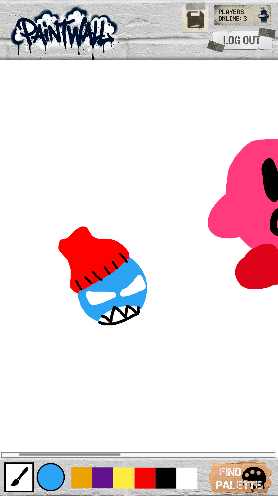
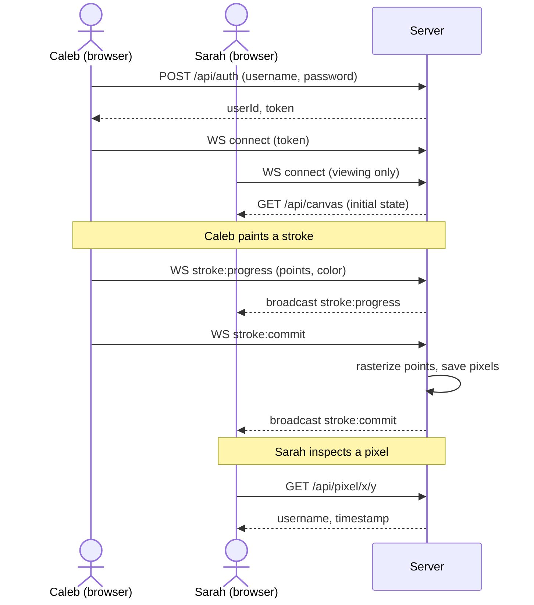

# Paintwall (Co-op Grafitti Canvas)

[My Notes](notes.md)
[https://paintwall.net] (https://paintwall.net)

Paintwall is a public shared canvas with digital paint tools. Users can "log in" by providing a name. Once logged in, they can add their own strokes to the canvas. Each pixel is stored on the backend and is associated with the painter's username, allowing anyone who clicks on that section to view who painted it. 

> [!NOTE]
> This is a template for your startup application. You must modify this `README.md` file for each phase of your development. You only need to fill in the section for each deliverable when that deliverable is submitted in Canvas. Without completing the section for a deliverable, the TA will not know what to look for when grading your submission. Feel free to add additional information to each deliverable description, but make sure you at least have the list of rubric items and a description of what you did for each item.

> [!NOTE]
> If you are not familiar with Markdown then you should review the [documentation](https://docs.github.com/en/get-started/writing-on-github/getting-started-with-writing-and-formatting-on-github/basic-writing-and-formatting-syntax) before continuing.

### Elevator pitch

Shared digital canvases such as r/place have become massive community events, but they are time-limited by nature. What if there was a public canvas that simply... stayed? Paintwall is a public digital graffiti wall where every pixel remembers who drew it. Featuring digital paint tools, a real-time shared canvas, and individual attribution for every drawing, Paintwall is a fun and creative application that showcases the power of WebSocket and individual artists.

### Design

This sequence diagram shows how user Caleb can log in and paint a stroke, while user Sarah can view the canvas, which dynamically updates as user Caleb paints.

```mermaid
sequenceDiagram
    actor A as Caleb (browser)
    actor B as Sarah (browser)
    participant S as Server

    A->>S: POST /api/auth (username, password)
    S-->>A: userId, token
    A->>S: WS connect (token)
    B->>S: WS connect (viewing only)
    S-->>B: GET /api/canvas (initial state)

    Note over A,S: Caleb paints a stroke
    A->>S: WS stroke:progress (points, color)
    S-->>B: broadcast stroke:progress
    A->>S: WS stroke:commit
    S->>S: rasterize points, save pixels
    S-->>B: broadcast stroke:commit

    Note over B,S: Sarah inspects a pixel
    B->>S: GET /api/pixel/x/y
    S-->>B: username, timestamp
```

### Key features

- Real-time collaborative canvas — watch other users' strokes appear live as they paint, with no refresh needed
- Full attribution — click any painted pixel to see exactly who drew it and when
- Zero-friction identity — jump in with just a username; add a password only if you want to protect it from being used by others
- Color palette suggestions — pull complementary color schemes from a third-party color API while you paint
- Permanent canvas — unlike time-limited events, the wall persists between sessions instead of resetting

### Technologies

I am going to use the required technologies in the following ways.

- **HTML** - One properly-structured HTML page (index.html) serving as the mount point for the React app. Uses semantic elements (`<header>`, `<main>`, `<canvas>`, etc.) for the app shell.
- **CSS** - Application uses CSS to provide website styling and drawing components (this may require more JavaScript than CSS; unsure right now) and to ensure the website looks good on mobile (vertical AND horizontal) and PC.
- **React** - Component-based views for logged-out (canvas + click-to-inspect ownership) and logged-in (adds drawing toolbar) states. Routes between these based on auth state — no page reload. Handles login, artist ownership display, and backend endpoint calls.
- **Service** - Backend service with endpoints for:
  - Combined register/login and logout for users (this application can collate the login and register functions into one, since it won't store any PII and doesn't require great security)
  - Color palette recommendations provided by the API at https://www.thecolorapi.com/
  - Getting the current canvas state for initial page load
  - Getting the username of whoever painted a selected pixel
- **DB** - Stores pixel ownership (x, y, color, user_id), user accounts (username, optional password hash), and session/auth tokens.
- **WebSocket** - Submits a finished or partially-finished stroke from the user to the backend, renders other users' strokes live without polling or refreshing, and broadcasts a live user count.

## 🚀 Specification Deliverable

> [!NOTE]
> Fill in this sections as the submission artifact for this deliverable. You can refer to this [example](https://github.com/webprogramming260/startup-example/blob/main/README.md) for inspiration.

For this deliverable I did the following. I checked the box `[x]` and added a description for things I completed.

- [x] I completed the prerequisites for this deliverable (Git commit requirement)
- [x] Proper use of Markdown
- [x] A concise and compelling elevator pitch
- [x] Description of key features
- [x] Description of how you will use each technology including your 3rd party API and use of WebSocket
- [x] One or more rough sketches of your application. Images must be embedded in this file using Markdown image references.

## 🚀 AWS deliverable

For this deliverable I did the following. I checked the box `[x]` and added a description for things I completed.

- [x] **Rented EC2 server** - Used AWS to rent an EC2 server
- [x] **Leased domain name** - Leased domain name [https://paintwall.net] (https://paintwall.net) for about $16 a year.
- [x] **Server accessible** from my domain: [https://paintwall.net] (https://paintwall.net) - I attached my domain to my EC2 instance.

## 🚀 HTML deliverable

For this deliverable I did the following. I checked the box `[x]` and added a description for things I completed.

- [x] I completed the prerequisites for this deliverable (Simon deployed, GitHub link, Git commits)
- [x] **HTML pages** - Created `index.html` (the wall + auth), `artists.html` (leaderboard), `profile.html` (personal avatar painter + drawing score), and `about.html` (pitch/features/tech), each with a shared header/nav/footer.
- [x] **Proper HTML element usage** - Used semantic elements throughout: `header`, `nav`, `ul`, `main`, `section`, `article`, `aside`-style `fieldset`, `figure`/`figcaption`, `table`, `dl`, `canvas`, and `form`. Verified by AI to be proper.
- [x] **Links** - Nav links between all three pages on every page, plus external links to the GitHub repo and the TheColorAPI third-party service.
- [x] **Text** - Elevator pitch, feature list, and technology descriptions from the specification are rendered as page content on `about.html`. All other pages contain brief descriptions of how to interact with the website, and player information is simulated at the bottom of `index.html`.
- [x] **3rd party API placeholder** - `index.html` has a color palette suggestions panel that will be populated from https://www.thecolorapi.com/.
- [x] **Images** - `about.html` embeds `images/app_mockup.png`; `artists.html` uses `images/placeholder.png` as avatar placeholders. 
- [x] **Login placeholder** - `index.html` has a login/register form and a logged-in profile panel showing the current username. Upon CSS implementation, the login forms will disappear once the user is logged in.
- [x] **DB data placeholder** - `artists.html` renders a leaderboard table of top painters that will be populated from stored pixel/user data. The player's level shows next to their username in the header on every page, and `profile.html` has a player statistics section with an XP bar that increases as pixel batches are stored for the wall.
- [x] **WebSocket placeholder** - `index.html` has a live activity feed and viewer count that will be populated from WebSocket messages. The canvas itself will also update via websocket.

## 🚀 CSS deliverable

For this deliverable I did the following. I checked the box `[x]` and added a description for things I completed.

- [x] I completed the prerequisites for this deliverable (Simon deployed, GitHub link, Git commits)
- [x] **Visually appealing colors and layout. No overflowing elements.** - I did indeed complete this part of the deliverable. My logo mandated a header that wasn't too bright or dark in color, so that defined the look of the app. I will also work on graphics for a Y2k grunge toggle that reskins the website. Everything looks clean.
- [x] **Use of a CSS framework** - Using bootstrap. I thought about Tailwind, but I figured that Bootstrap would be better for the way the deliverables were structured, and I didn't want to have to return to the CSS if I didn't have to.
- [x] **All visual elements styled using CSS** - They sure are. I had to experiment a bit to find a color scheme that worked with my current logo. That may change appearance, so I may need to change this again. Sigh. Anyways, it looks much better, and I tried to make a satisfying layout.
- [x] **Responsive to window resizing using flexbox and/or grid display** - This was a minor headache. I had Claude try implementing much of this; it didn't understand several key things, and I had to go in and change them to fit better myself any time Claude gave it a shot. Interesting limitation there. Anyways, everything should react properly at all sizes.
- [x] **Use of a imported font** - I chose the simple and clean "Clarity City" Google font.
- [x] **Use of different types of selectors including element, class, ID, and pseudo selectors** - The element selectors keep the entire website feeling cohesive. Headers, buttons, canvas... All have their own established look. The class selectors can apply to different elements so they have the same rule, useful for my canvas section, activity section, etc. which all use the "panel" class. IDs target the elements individually, allowing canvas to break the standard constraints and fill the screen. The pseudo selector for my hamburger icon allows it to act as a menu even when no javascript exists yet.

## 🚀 React part 1: Routing deliverable

For this deliverable I did the following. I checked the box `[x]` and added a description for things I completed.

- [x] I completed the prerequisites for this deliverable (Simon deployed, GitHub link, Git commits)
- [x] **Bundled using Vite** - Vite is included, package.json scripts updated
- [x] **Components** - NavLink components are replacing the `<a>` components in navbar, className used instead of class, html is moved to .jsx elements
- [x] **Router** - Everything routes to .jsx files

#### Canvas/painting design plan (worked out ahead of implementation, saved here so it isn't lost)

The painting system is the last piece of this deliverable to build. Plan before starting:

- **Canvas data model** - A grid of pixels at a **fixed size, decided up front: 1280x720 (720p)**. Each pixel stores a color and a numeric user ID (not a username string) — usernames live once in a DB table, keyed by that ID, so the per-pixel cost is small and fixed regardless of username length. Whoever painted a pixel last owns it (later strokes simply overwrite the pixel's owner).
- **Username safety** - The risk isn't "code injection" running against the canvas (pixel data is never executed) — it's **XSS**: a malicious username rendered unescaped into the DOM (e.g. an attribution tooltip) could run as HTML/JS. Mitigate with:
  1. A strict allowlist at registration (alphanumeric + a few safe characters, length-capped) so a bad string is never stored in the first place.
  2. Always render usernames as plain JSX text (`{username}`), never via `dangerouslySetInnerHTML` — React escapes text content by default.
- **Keeping the initial canvas payload small at 1280x720 (921,600 pixels)** - the grid itself isn't too large for the server to hold in memory (it's the naive encoding that would be), so the focus is the one-time transfer to each new viewer:
  1. Use a **fixed, limited color palette** (e.g. ≤256 colors) so each pixel's color is a 1-byte palette index, not a 3-byte RGB value.
  2. Transfer the grid as **raw binary** (a typed array's buffer, `application/octet-stream` or a binary WS frame), not JSON — encoding numbers as text bloats size 3-5x and costs parse time.
  3. **Split color and owner-ID into two separate contiguous buffers** instead of interleaving them per-pixel — compression works much better on long runs of the same value, which interleaving breaks up.
  4. **Enable gzip/Brotli** (HTTP response compression, WS `perMessageDeflate`) - an unpainted region is a long run of one repeated byte, which compresses to almost nothing.
  5. **Don't ship the owner-ID plane on initial load at all.** Send only the color plane to render the wall; fetch a pixel's owner on-demand via the existing `GET /api/pixel/x/y` endpoint only when a viewer actually clicks to inspect it.
  6. The full grid is only ever sent **once per session** - all painting after that travels as small incremental stroke diffs over WebSocket (see batching below), so this cost doesn't recur.
- **Component split** - `wall.jsx` is the *page* (layout + composes the toolbar and canvas, owns the selected tool/color/size state via `useState`). A separate component (e.g. `PaintCanvas.jsx`) owns the `<canvas>` ref and all drawing logic. Tool state is passed down as props from `wall.jsx` — the canvas component doesn't know or care *which* tool is selected, only "paint this shape/size/color at this point."
- **Brushes** - A brush is a small reusable stamp pattern (Photoshop-style), scalable up/down, applied at a point on drag/click. Since each pixel stores exactly one owner (no alpha blending), brush masks should be **binary** (paint / don't-paint), e.g. a grayscale brush image thresholded at ~50% opacity, rather than alpha-composited — this keeps pixel ownership unambiguous. Scaling a brush is just resizing that small mask bitmap (nearest-neighbor keeps a pixel-art look; try bilinear too for softer edges).
- **Stroke batching over WebSocket** - Don't send an update every frame. Buffer painted points client-side into a "stroke," and flush to the server on **whichever comes first**: every `n * size_modifier` points, or a ~100ms timer (so a slow/still drag isn't stranded waiting for a point count that never arrives) — plus always flush on pointer-up/leave/cancel so the tail of a stroke is never lost.
- **Server is the source of truth for rasterization** - The server resolves a submitted stroke into the actual list of affected pixels (`x, y, color, username`) and broadcasts *that* list to other clients (matches the existing `stroke:commit` step in the sequence diagram above) — clients never need to reimplement brush rasterization themselves to stay in sync.
- **Local responsiveness (later, not blocking)** - The painting user's own cursor/stroke should render immediately client-side (optimistic), independent of the batching/flush timer to the server — otherwise painting will feel laggy while waiting on round trips.

## 🚀 React part 2: Reactivity deliverable

For this deliverable I did the following. I checked the box `[x]` and added a description for things I completed.

- [ ] I completed the prerequisites for this deliverable (Simon deployed, GitHub link, Git commits)
- [ ] **All functionality implemented or mocked out** - I did not complete this part of the deliverable.
- [ ] **Hooks** - I did not complete this part of the deliverable.

## 🚀 Service deliverable

For this deliverable I did the following. I checked the box `[x]` and added a description for things I completed.

- [ ] I completed the prerequisites for this deliverable (Simon deployed, GitHub link, Git commits)
- [ ] **Node.js/Express HTTP service** - I did not complete this part of the deliverable.
- [ ] **Static middleware for frontend** - I did not complete this part of the deliverable.
- [ ] **Calls to third party endpoints** - I did not complete this part of the deliverable.
- [ ] **Backend service endpoints** - I did not complete this part of the deliverable.
- [ ] **Frontend calls service endpoints** - I did not complete this part of the deliverable.
- [ ] **Supports registration, login, logout, and restricted endpoint** - I did not complete this part of the deliverable.
- [ ] **Uses BCrypt to hash passwords** - I did not complete this part of the deliverable.

## 🚀 DB deliverable

For this deliverable I did the following. I checked the box `[x]` and added a description for things I completed.

- [ ] I completed the prerequisites for this deliverable (Simon deployed, GitHub link, Git commits)
- [ ] **Stores data in MongoDB** - I did not complete this part of the deliverable.
- [ ] **Stores credentials in MongoDB** - I did not complete this part of the deliverable.

## 🚀 WebSocket deliverable

For this deliverable I did the following. I checked the box `[x]` and added a description for things I completed.

- [ ] I completed the prerequisites for this deliverable (Simon deployed, GitHub link, Git commits)
- [ ] **Backend listens for WebSocket connection** - I did not complete this part of the deliverable.
- [ ] **Frontend makes WebSocket connection** - I did not complete this part of the deliverable.
- [ ] **Data sent over WebSocket connection** - I did not complete this part of the deliverable.
- [ ] **WebSocket data displayed** - I did not complete this part of the deliverable.
- [ ] **Application is fully functional** - I did not complete this part of the deliverable.